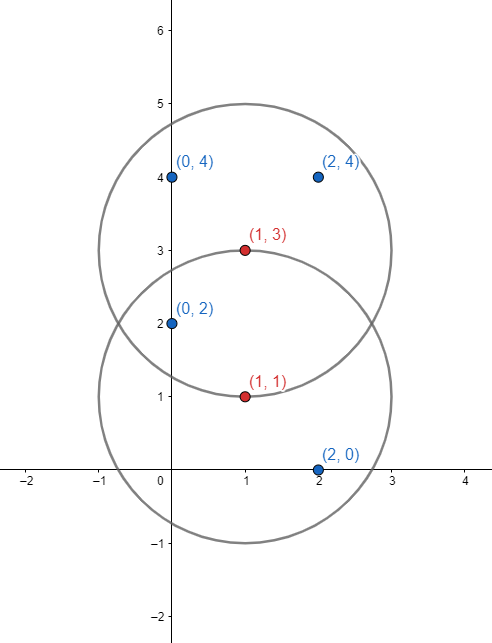

### December 27 - Commnuity Park

  #### Problem Statement 
 
  - For the past 1 month the community park has been facing a lot of electricity issues.This has affected the park lighting very badly. Adults and children face       difficulty in utilizing the park during the nights. The association members have decided to solve this issue after finding a cost efficient lightning option. 
  - Consider each light source can illuminate a circular area with a radius r. Consider there are n major spots in the park , each located at (xi,yi) point.         Since they want to minimize the expenses,they want to buy a minimum number of light sources (k), such that each major spot  is illuminated by at least 1         light source.
  - In other words, your task is to select a minimum number of points in the plane, such that for each given point , there exists a chosen point at a distance of     at most r.
  - Note: More than one light source can be placed at a specific spot
  
  <p align="center"></p>       
 
 #### Sample Input/Output 
  ```
    Input: 
    n=4 r=2
    x y
    0 2
    0 4
    2 0
    2 4

        
    Output: 
    2
    1 3
    1 1

  ```
  ```
   Input: 
   n=3 r=2
   x y
   1 4
   0 2 
   4 2

   Output: 
   1
   2 2

  ```
   #### Explanation
 
  <p align="center"></p>
  
   In the first test  case  there are 4 major spots located at (0,2) (0,4) (2,0) (2,4) and the radius of illumination is given as 2 units.
   We can see that if we place 2 light sources at (1,3) and(1,1) , it would cover all the given major areas. Though there are other options, we aim at                minimizing the number of lights ,so  2 light sources are enough to illuminate the given major spots in the park.
   Then number of light sources along with their coordinates are displayed.
   
  
 
